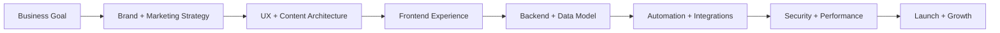

<div align="center">


<br />
<br />

<a href="https://www.mr-gfx.com"></a>
<a href="mailto:info@mr-gfx.com"></a>
<a href="mailto:mohamedreda.gfx@gmail.com"></a>


</div>

---

## Executive Snapshot

```ts
const mohamedReda = {
  brand: "MR GFX",
  companies: ["MR GFX", "Mashhor Hub"],
  position: "Full-stack engineer, creative technologist, and digital growth builder",
  builds: [
    "web platforms and portfolio systems",
    "marketing funnels and SEO-ready pages",
    "admin dashboards and secure portals",
    "REST APIs and database-backed products",
    "AI-assisted operations and automation workflows",
    "influencer, CRM, Telegram bot, and content systems",
  ],
  standard: "Sharp design, reliable architecture, measurable growth, secure delivery.",
};
```

I help brands turn ideas into polished digital products and growth systems. My work connects UI/UX, full-stack development, digital marketing, influencer operations, AI automation, API integrations, deployment, performance, and practical business workflows.

---

## Companies & Platforms

<table>
<tr>
<td width="50%" valign="top">

### MR GFX

Creative technology studio focused on digital identity, web presence, UI/UX, portfolio experiences, landing pages, automation, and production-ready business tools.

</td>
<td width="50%" valign="top">

### Mashhor Hub

Influencer and marketing platform direction for campaigns, creator operations, bilingual experiences, dashboards, orders, customers, projects, invoices, and scalable public-facing services.

</td>
</tr>
</table>

---

## Professional Capabilities

<table>
<tr>
<td width="50%" valign="top">

### Engineering

- Next.js, React, TypeScript, JavaScript
- Node.js, Express, REST APIs
- Firebase, Firestore, Supabase, PostgreSQL, MongoDB
- Authentication, permissions, dashboards, admin portals
- Performance, SEO, accessibility, Core Web Vitals
- GitHub, Vercel, deployment, release workflows

</td>
<td width="50%" valign="top">

### Marketing & Growth

- Digital marketing strategy and campaign structure
- Social media presence, content systems, and creator workflows
- SEO-ready landing pages and service pages
- Lead generation, CRM-style intake, and conversion flows
- Analytics-ready funnels and operational dashboards
- Brand messaging, visual direction, and launch assets

</td>
</tr>
</table>

---

## Delivery System



- Build the smallest correct version first, then improve it with purpose.
- Preserve working systems, contracts, routes, APIs, data, and user flows.
- Design clear states for loading, empty, error, success, and edge cases.
- Protect secrets, uploads, sessions, admin routes, and customer data.
- Measure quality through usability, reliability, speed, SEO, conversion, and maintainability.

---

## Toolbox

<div align="center">


<br />
<br />


</div>

---

## What I Optimize

<table>
<tr>
<td width="25%" valign="top">

### Product

Clear journeys, strong first impression, and workflows users understand quickly.

</td>
<td width="25%" valign="top">

### Growth

Campaign readiness, SEO foundations, conversion paths, content systems, and analytics signals.

</td>
<td width="25%" valign="top">

### Engineering

Maintainable code, reusable patterns, API reliability, validation, observability, and secure defaults.

</td>
<td width="25%" valign="top">

### Operations

Dashboards, automation, CRM flows, creator workflows, and less manual work for teams.

</td>
</tr>
</table>

---

## GitHub Numbers

<div align="center">


<br />
<br />


</div>

---

## Contribution Activity

<div align="center">


</div>

---

## Contact

| Purpose | Contact |
|---|---|
| Business / MR GFX | [info@mr-gfx.com](mailto:info@mr-gfx.com) |
| Direct contact | [mohamedreda.gfx@gmail.com](mailto:mohamedreda.gfx@gmail.com) |
| Website | [www.mr-gfx.com](https://www.mr-gfx.com) |
| GitHub | [github.com/mr-socialmedia](https://github.com/mr-socialmedia) |

<div align="center">


</div>
