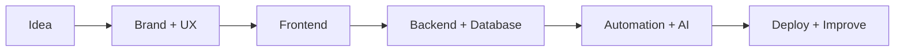

<div align="center">


<a href="https://github.com/mr-socialmedia">
  
</a>

<br />


<br />

<a href="https://www.mr-gfx.com"></a>
<a href="mailto:hello@mr-gfx.com"></a>
<a href="https://github.com/mr-socialmedia"></a>


</div>

---

## whoami

```ts
const mohamed = {
  brand: "MR GFX",
  role: "Full-stack developer, UI/UX maker, automation engineer",
  focus: [
    "production-ready web apps",
    "admin dashboards and portals",
    "AI-powered workflows",
    "Telegram bots and business automation",
    "brand systems and creative digital experiences",
  ],
  mindset: "Design the experience, engineer the system, ship the result.",
};
```

I build practical digital products that look polished, load fast, and solve real business problems. My work blends creative direction, full-stack engineering, automation, AI tools, integrations, and deployment discipline.

---

## What I Build

<table>
<tr>
<td width="50%" valign="top">

### Product Engineering

- Full-stack websites and web apps
- React / Next.js interfaces
- Node.js / Express APIs
- Firebase, Firestore, Supabase backends
- Auth, admin panels, dashboards, and portals
- REST API integrations and reliable data flows

</td>
<td width="50%" valign="top">

### Creative Systems

- MR GFX-style brand and visual direction
- Landing pages and SEO-ready pages
- UI/UX for business workflows
- AI content and productivity systems
- Telegram bots and workflow automation
- Launch, GitHub, Vercel, and production handoff

</td>
</tr>
</table>

---

## Toolbox

<div align="center">


<br />
<br />


</div>

---

## Featured Focus



- I prefer small, safe, production-ready changes over noisy rewrites.
- I care about clean UI states: loading, empty, success, error, and edge cases.
- I build with security in mind: secrets, sessions, uploads, permissions, and admin routes.
- I keep business value visible: performance, SEO, reliability, and maintainability.

---

## Numbers

<div align="center">


<br />
<br />


</div>

---

## Contribution Graph

<div align="center">


</div>

---

## Current Direction

```txt
MR GFX       -> creative digital identity, design, and web presence
Engineering  -> Next.js, APIs, databases, dashboards, deployment
Automation   -> AI workflows, Telegram bots, CRM-style operations
Quality      -> secure defaults, clean UX, performance, maintainability
```

<div align="center">

### Let us build something sharp.

<a href="https://www.mr-gfx.com"></a>
<a href="mailto:hello@mr-gfx.com"></a>


</div>
